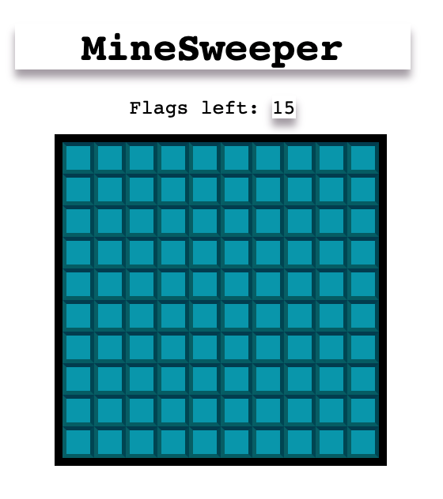
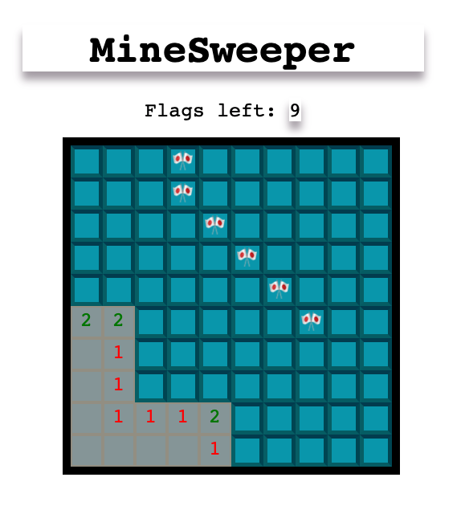
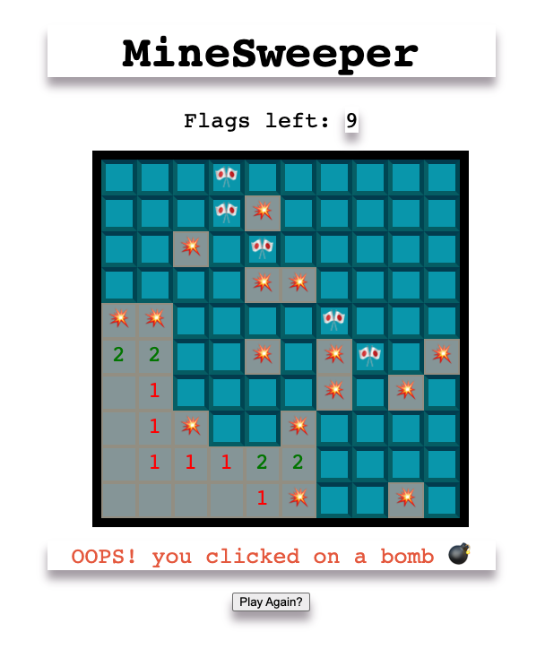

# MINESWEEPER

### Description
Minesweeper is a single player puzzle game. The goal of the game is to click on squares and clear the board without clicking
on hidden mines. The clues are provided in terms of number of neighbor mines that could be directly connected to any of square's edges that were clicked before. 

#### History
The Minesweeper was created for windows by Microsoft employees, Rober Donner and Curtis Johnson, in 1990.

### Screenshots
- 

- 

- 

## Technologies Used

- Html, CSS and JavaScript

## Getting Started

https://khawarrr.github.io/project1_minesweeper/

## Next Steps

- Add count up timer 
- Add a Happy/Sad Emoji that would alternate depending on different states of game
- last but not least add a background music to the game.
